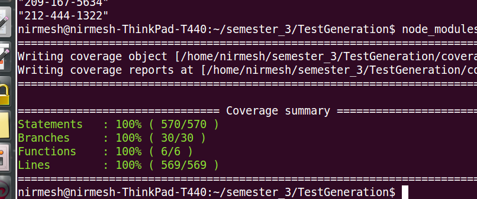

## Screen Shot of results



## Test Generation

The goal of this work shop is to learn use a combination of mocking, random testing, and feedback-directed testing to automatically increase testing coverage. This is a powerful technique that can automatically discover bugs in new commits deployed to a build server before hitting production or affecting canary servers.

    git clone https://github.com/CSC-DevOps/TestGeneration.git
    cd TestGeneration
    npm install

Directory Contents:

* **main.js**: Main code driving constraint discovering and test case generation.
* **subject.js**: This is the code we are testing. It contains some simple code with operations on strings, integers, files, and phone numbers.
* **test.js**: This is an automatically created test script. Running `node main.js` will create a new `test.js`.

### Code Coverage

Code coverage can be an effective way to measure how well tested a code system is. To see code coverage in action, we will run `istanbul` on our "test suite", represented by 'test.js'.

##### Getting a simple coverage report

[Useful resource](http://ariya.ofilabs.com/2012/12/javascript-code-coverage-with-istanbul.html) for istanbul.

You can run the local version as follows:

    node_modules/.bin/istanbul cover test.js
    node_modules\.bin\istanbul cover test.js (Windows)

To install istanbul globally, saving some keystrokes, you can do the following:

    npm install istanbul -G

You'll get a high level report as follows (a more detailed report will be stored in `coverage/`):
<pre>
=============================== Coverage summary ===============================

Statements   : 80% ( 4/5 )
Branches     : 50% ( 1/2 )
Functions    : 100% ( 1/1 )
Lines        : 100% ( 4/4 )
================================================================================
</pre>

##### See a fully annotated html report here:
    
    open coverage/lcov-report/TestGeneration/subject.js.html
    start coverage/lcov-report/TestGeneration/subject.js.html (Windows)

### Test Generation with Constraints and Mocking

Note that main.js has generated some test cases already. But now want to improve our coverage.

##### Constraint discovery

One of our functions, `inc(p,q)` is as follows:

```javascript
function inc(p, q){
   if(q ==undefined) q =1;
   if( p < 0 )
   {
   	p = -p;
   }
   return p + q/q;
}
```

Right now, the discovery engine looks for expressions, such as `q == 0`, and are used to help generate test cases, such as:

    subject.inc('',0);

But notice that p has no concrete value associated with it, instead if just has a default value of `''`.

* 1) Extend the constraint discovery to handle expressions, such as '<' and '>'.
* 2) Extend code to better handle string types, especially with operations such as != "string".

##### Mocking

Testing file system code in unit tests can be challenging. One helpful tool is to use mocking.

The [mock-fs framework](https://github.com/tschaub/mock-fs) can be used to generate a fake file system to help improve coverage.

For example, this is a fake filesystem you can create:

```
mock({
  'path/to/fake/dir': {
    'some-file.txt': 'file content here',
    'empty-dir': {/** empty directory */}
  },
  'path/to/some.png': new Buffer([8, 6, 7, 5, 3, 0, 9]),
  'some/other/path': {/** another empty directory */}
});
```

For example, the following is automatically generated to create to test the function, `fileTest`.

```Javascript
mock({"path/fileExists":{},"pathContent":{"file1":"text content"}});
	subject.fileTest('path/fileExists','pathContent/file1');
mock.restore();
```

* 1) Extend the mock system to handle creating empty directories and directories with content, but checking when a function parameter is every used in a "readdirSync" call.
* 2) Extend the test case generation to be handle more code relying on file systems: Hint, there is a simple change you can make under:

    // Bonus...generate constraint variations test cases....


##### Other ways to improve coverage

Use clues in the code to automate the process of including file system, phone number mocking without manual injection.

* Negate constraints to help discovery.
* Handle string operations such as "indexOf".
* Handle object properties such as "normalize".
* Use the `faker` framework to generate a fake phone number to help improve coverage.

[faker.js docs](https://github.com/Marak/faker.js), [mock-fs docs](https://www.npmjs.com/package/mock-fs)


## Other Resources

### Test Generation in Java

Download randoop:

    wget https://randoop.googlecode.com/files/randoop.1.3.4.jar

Sample execution to generate tests for all classes in the java.util.Collections namespace (Need Java 7):

    java -classpath randoop.1.3.4.jar randoop.main.Main gentests --testclass=java.util.TreeSet --testclass=java.util.Collections --timelimit=60

This will create a file `RandoopTest.java`, which contains a test driver, and `RandoopTest0.java`, which contains the generated unit tests.

### Coverage in Java

[Emma](http://emma.sourceforge.net/intro.html) is a decent option to collect coverage information form a java program.


# Errors

> make: Entering directory `/home/vagrant/TestGeneration/node_modules/random-js/node_modules/microtime/build'
  CXX(target) Release/obj.target/microtime/src/microtime.o
make: g++: Command not found
make: *** [Release/obj.target/microtime/src/microtime.o] Error 127

Fix with installing g++ on your system, such as `apt-get install g++`
